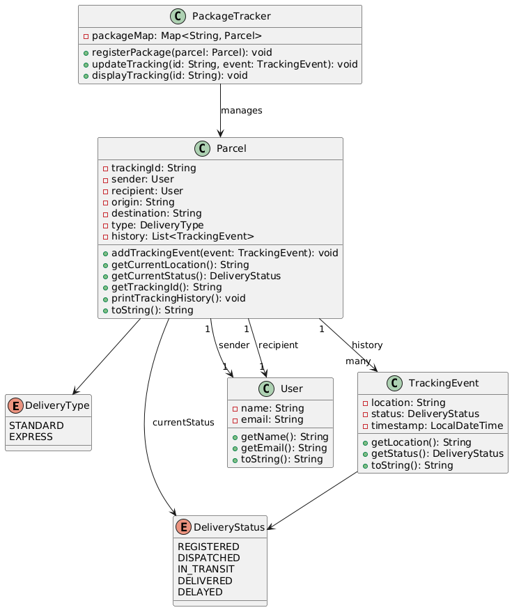

# Package Tracking System

A Java-based package tracking system that allows users to register packages, update their tracking status, and view tracking history.

## Features

- Register new packages with unique tracking IDs
- Update package tracking status with location and timestamp
- View complete package tracking history
- Support for different delivery types (STANDARD, EXPRESS)
- Tracking statuses include: REGISTERED, DISPATCHED, IN_TRANSIT, DELIVERED, DELAYED

## UML Diagram



_Basic UML Structure_

## Class Structure

```
PackageTracking/
├── Main.java
├── models/
│ ├── Package.java
│ ├── TrackingEvent.java
│ ├── DeliveryType.java
│ ├── DeliveryStatus.java
│ └── User.java
├── service/
│ └── PackageTracker.java
```

### Key Classes

- **Package**: Represents a shipping package with tracking information
- **TrackingEvent**: Records status updates with location and timestamp
- **User**: Stores sender/recipient information
- **PackageTracker**: Core service class for managing packages
- **Main**: Command-line interface for interacting with the system

## Getting Started

### Prerequisites

- Java JDK 8 or later

### Running the Application

1. Clone the repository:

   ```bash
   git clone https://github.com/yourusername/PackageTracking.git
   ```

2. Navigate to the project directory:

   ```bash
   cd PackageTracking
   ```

3. Compile and run:

   ```bash
   javac Main.java && java Main
   ```

## Usage

The system provides a simple command-line interface with these options:

### 1. Register new package

- Enter sender details:
  - Name
  - Email address
- Enter recipient details:
  - Name
  - Email address
- Specify:
  - Origin location
  - Destination
- Choose delivery type:
  - `STANDARD`
  - `EXPRESS`

### 2. Add tracking update

- Enter the package's tracking ID
- Provide current location
- Update status (choose from):
  - `REGISTERED`
  - `DISPATCHED`
  - `IN_TRANSIT`
  - `DELIVERED`
  - `DELAYED`

### 3. View package tracking

- Enter tracking ID to see:
  - Current status
  - Current location
  - Full tracking history with timestamps

### 4. Exit

- Terminates the program

## 🖥️ Command Line Usage

### 1. Register New Package

```text
1. Provide sender details:
   - Name: John Doe
   - Email: john@example.com
2. Provide recipient details:
   - Name: Jane Smith
   - Email: jane@example.com
3. Enter locations:
   - Origin: New York
   - Destination: Los Angeles
4. Select delivery type (STANDARD/EXPRESS): EXPRESS

Package registered with tracking ID: a1b2c3d4
```

### 2. Update Tracking Status

```text
1. Enter tracking ID: a1b2c3d4
2. Current location: Chicago
3. Select status:
   → REGISTERED
   → DISPATCHED
   → IN_TRANSIT
   → DELIVERED
   → DELAYED

Tracking updated successfully.
```

### 3. View Package History

```text
1. Enter tracking ID: a1b2c3d4

Package a1b2c3d4 (EXPRESS)
From: John Doe → Jane Smith
New York → Los Angeles

Tracking History for Parcel: a1b2c3d4
[2025-06-04 17:47] REGISTERED @ New York
[2025-06-05 12:00] DISPATCHED @ New York
[2025-06-05 23:15] IN_TRANSIT @ Chicago
```

### 4. Exit

```text
Exiting
```
